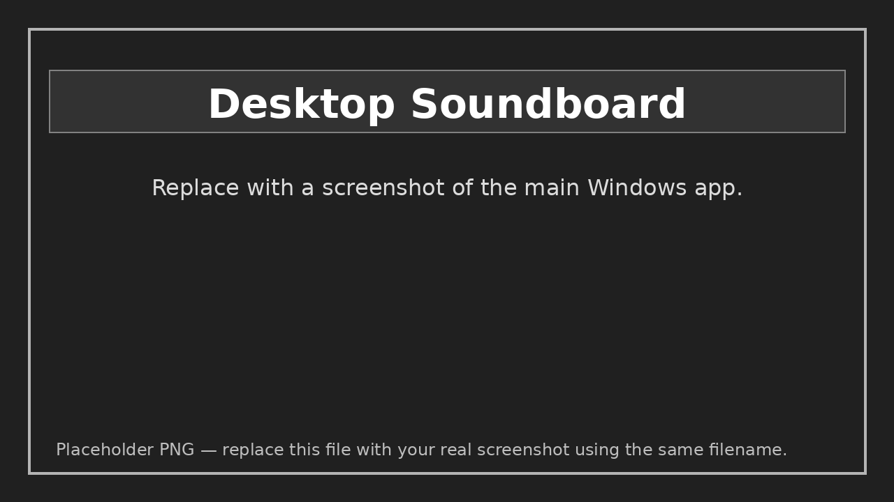
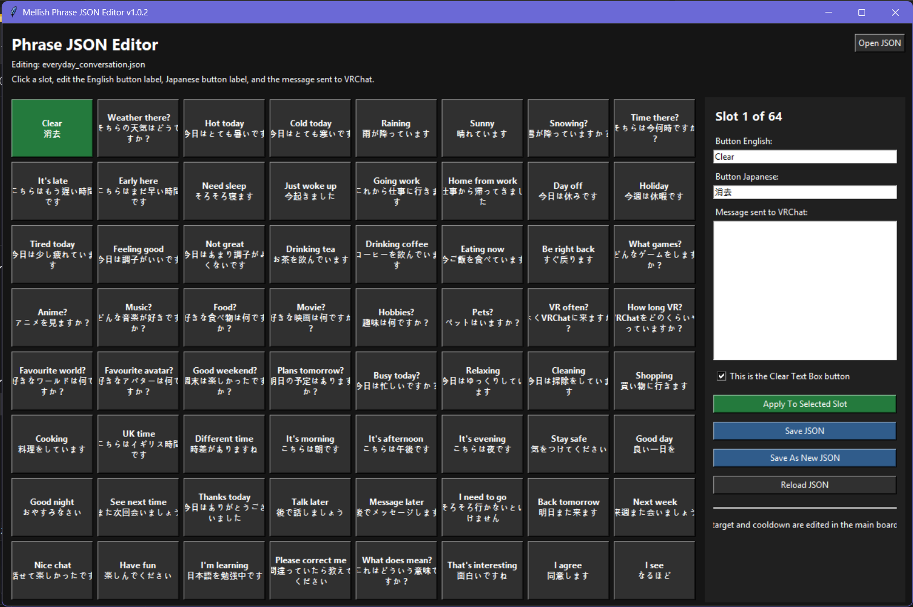
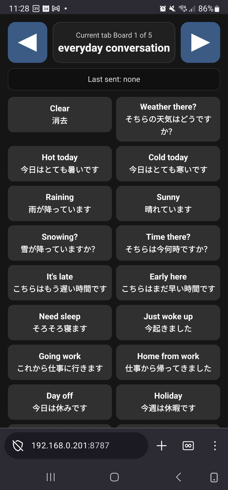
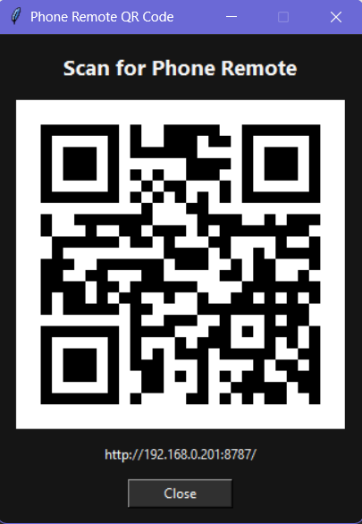

# Mellish's Multilingual Mute Soundboard

A lightweight OSC phrase board for VRChat's chatbox.

This tool is designed for people who either cannot speak, do not want to speak, or need fast preset messages while in VRChat. It sends button-based phrases directly to the VRChat chatbox using OSC.

It was originally built to help communicate with Japanese VRChat users during hosted events, using English, Japanese, and Romaji on the same button/message.

## Screenshots

### Desktop Soundboard



### Editor Soundboard



### Phone Remote



### QR Code Popup



## Features

- Sends preset phrases to the VRChat chatbox through OSC
- Current loaded board name shown at the top centre
- Full last-sent phrase shown underneath the current board name
- Tab buttons expand to fit longer JSON filenames
- 64-button soundboard grid
- Five loadable JSON phrase boards
- Tab names are automatically based on the JSON filename
- English and Japanese text on each button
- Full message can include English / Japanese / Romaji
- Custom message box
- Configurable cooldown
- Editable OSC IP and port
- Dark mode and softer grey light mode
- Separate visual JSON editor
- Clear text box button
- Built-in Phone Remote web interface
- Phone/tablet access from the same local network
- Remote board switching between loaded boards 1–5
- Remote last-sent message display
- QR code popup for quick phone connection
- Optional `build_exe.bat` included for creating Windows EXE files

## Use Case

The app is intended to sit on a second monitor, desktop overlay, or OVR-style wrist view while using VRChat.

The Phone Remote is intended for quick access from a phone or tablet on the same local network.

Example button:

```txt
Follow me
ついて来て
```

Message sent to VRChat:

```txt
Follow me / ついて来てください / Tsuite kite kudasai
```

## Requirements

To run from source:

- Windows
- Python 3.10 or newer
- VRChat with OSC enabled
- Flask
- qrcode
- Pillow

To build EXEs:

- Python 3.10 or newer
- PyInstaller
- Flask
- qrcode
- Pillow
- `build_exe.bat` will install PyInstaller into a local `.venv` if configured to do so

## Python Dependencies

Install the required packages:

```txt
py -m pip install flask qrcode pillow
```

Or:

```txt
pip install flask qrcode pillow
```

These packages are used for:

| Package | Purpose |
|---|---|
| Flask | Phone Remote web server |
| qrcode | QR code generation |
| Pillow | QR code image support |

## VRChat Setup

1. Open VRChat.
2. Open the Action Menu.
3. Go to Options.
4. Enable OSC.
5. Run `run_soundboard.bat`.
6. Press a phrase button.

Default OSC target:

```txt
127.0.0.1:9000
```

OSC endpoint used:

```txt
/chatbox/input
```

## Running the App

Run:

```txt
run_soundboard.bat
```

Or manually:

```txt
python Mellishs_Multilingual_Mute_Soundboard.py
```

## Phone Remote

The soundboard includes a built-in Phone Remote interface.

The remote allows you to:

- View the currently loaded board
- Press phrase buttons from a phone or tablet
- Switch between the five loaded boards
- See the last message that was sent
- Connect quickly using a QR code

### Starting the Remote

1. Launch the soundboard.
2. Set the web port.
3. Click **Start Remote**.
4. The status will change to **Running**.
5. Click **Show QR** and scan the QR code, or browse to the displayed URL manually.

Example URL:

```txt
http://192.168.1.50:5000
```

### Remote Controls

The top of the phone page contains:

```txt
← Previous Board
Current Board Name
Next Board →
```

Below that is the last-sent message area.

The rest of the page displays the same phrase buttons as the desktop application.

Pressing a button on the phone sends the same OSC message as pressing that button in the desktop application.

### Network Note

The Phone Remote is intended for devices on the same local network.

Do not port-forward it to the public internet unless you understand the security risk.

## Editing Phrase Boards

Run:

```txt
run_phrase_editor.bat
```

Or manually:

```txt
python Phrase_Board_JSON_Editor.py
```

The editor lets you change:

- English button label
- Japanese button label
- Message sent to VRChat
- Whether a slot is the clear-text button

The OSC target, cooldown, and Phone Remote settings are edited in the main soundboard app.

## JSON Boards

The included boards are:

```txt
everyday_conversation.json
general_social.json
vrchat_technical.json
flirty_social.json
board_5.json
```

The main host board is:

```txt
host.json
```

If you load a file called:

```txt
japanese_helper.json
```

The tab will display:

```txt
japanese helper
```

## JSON Structure

Each phrase slot looks like this:

```json
{
  "button_en": "Hello",
  "button_ja": "こんにちは",
  "message": "Hello / こんにちは / Konnichiwa"
}
```

The clear button uses:

```json
{
  "button_en": "Clear",
  "button_ja": "消去",
  "message": "",
  "is_clear": true
}
```

## Building EXE Files

Run:

```txt
build_exe.bat
```

The build script will:

1. Create a local Python virtual environment.
2. Install required build dependencies.
3. Build the main soundboard EXE.
4. Build the JSON editor EXE.
5. Copy the JSON files into the `dist` folder.

The build environment needs:

```txt
pyinstaller
flask
qrcode
pillow
```

Output folder:

```txt
dist
```

Expected output:

```txt
dist/Mellishs_Multilingual_Mute_Soundboard.exe
dist/Phrase_Board_JSON_Editor.exe
everyday_conversation.json
general_social.json
vrchat_technical.json
flirty_social.json
board_5.json
dist/board_settings.json
```

## Adding Screenshots to GitHub

Screenshots are normal image files stored inside the repository.

Recommended layout:

```txt
README.md
screenshots/
  desktop_soundboard.png
  phone_remote.png
  qr_code_popup.png
```

Markdown image syntax:

```md


```

To update the screenshots later, replace the PNG files with new images using the same filenames.

## Notes

Japanese text is sent as UTF-8 OSC strings.

This has been tested with VRChat's chatbox OSC input, but VRChat can change OSC behaviour over time. If something stops working, first check that OSC is still enabled in VRChat.

## Suggested GitHub Topics

```txt
vrchat
osc
chatbox
accessibility
python
tkinter
japanese
translation
soundboard
flask
phone-remote
```

## License

MIT License.

====================================================================================================

# Mellish's Multilingual Mute Soundboard

VRChat のチャットボックス向けに開発された、軽量な OSC フレーズボードです。

音声での会話が難しい方、話したくない方、または定型文を素早く送信したい方のために設計されています。OSC を利用して、あらかじめ登録したフレーズを VRChat のチャットボックスへワンクリックで送信できます。

このツールは、イベント運営時に英語圏と日本語圏の VRChat ユーザー同士のコミュニケーションを支援する目的で開発されました。英語・日本語・ローマ字を同時に表示・送信できるため、言語交流や国際交流にも活用できます。

## スクリーンショット

> これらの PNG は仮画像です。実際のスクリーンショットに差し替えてください。

### デスクトップ版サウンドボード


### Phone Remote


### QR コード表示


## 主な機能

* OSC を利用した VRChat チャットボックス送信
* 現在読み込まれているボード名を画面上部中央に表示
* 最後に送信したメッセージをボード名の下に表示
* JSON ファイル名に応じてタブサイズを自動調整
* 64 個のフレーズボタンを搭載
* 最大 5 つの JSON フレーズボードを切り替え可能
* JSON ファイル名をもとにタブ名を自動生成
* ボタンに英語と日本語を同時表示
* 英語・日本語・ローマ字を含む多言語メッセージに対応
* カスタムメッセージ送信機能
* クールダウン時間の設定
* OSC の IP アドレスおよびポート番号の変更
* ダークモード／ライトモード対応
* 専用のビジュアル JSON エディターを同梱
* チャットボックス消去ボタン
* 内蔵 Phone Remote Web インターフェース
* 同じローカルネットワーク上のスマホ／タブレットから操作可能
* 読み込まれている 1〜5 番のボードをリモートで切り替え可能
* 最後に送信したメッセージをリモート画面にも表示
* QR コード表示による簡単接続
* Windows 用 EXE を作成するための `build_exe.bat` を同梱

## 想定用途

VRChat 利用中に、セカンドモニターやデスクトップオーバーレイ、OVR Toolkit などを利用して表示することを想定しています。

Phone Remote は、同じローカルネットワーク上のスマホやタブレットから素早く操作するための機能です。

ボタン表示例：

```txt
Follow me
ついて来て
```

送信されるメッセージ例：

```txt
Follow me / ついて来てください / Tsuite kite kudasai
```

## 動作環境

ソースコード版を実行する場合：

* Windows
* Python 3.10 以上
* OSC を有効化した VRChat
* Flask
* qrcode
* Pillow

EXE をビルドする場合：

* Windows
* Python 3.10 以上
* PyInstaller
* Flask
* qrcode
* Pillow

## Python 依存ライブラリ

必要なパッケージをインストールします：

```txt
py -m pip install flask qrcode pillow
```

または：

```txt
pip install flask qrcode pillow
```

各パッケージの用途：

| パッケージ | 用途 |
|---|---|
| Flask | Phone Remote 用 Web サーバー |
| qrcode | QR コード生成 |
| Pillow | QR コード画像処理 |

## VRChat 側の設定

1. VRChat を起動
2. Action Menu を開く
3. Options を選択
4. OSC を有効化
5. `run_soundboard.bat` を実行
6. フレーズボタンを押して送信

デフォルト OSC 送信先：

```txt
127.0.0.1:9000
```

使用する OSC エンドポイント：

```txt
/chatbox/input
```

## アプリの起動方法

バッチファイルを利用する場合：

```txt
run_soundboard.bat
```

Python から直接起動する場合：

```txt
python Mellishs_Multilingual_Mute_Soundboard.py
```

## Phone Remote

このサウンドボードには、内蔵の Phone Remote 機能があります。

Phone Remote では以下が可能です：

* 現在読み込まれているボードを表示
* スマホやタブレットからフレーズボタンを押す
* 読み込まれている 5 つのボードを切り替える
* 最後に送信したメッセージを確認
* QR コードで簡単接続

### Remote の起動方法

1. サウンドボードを起動します。
2. Web ポートを設定します。
3. **Start Remote** を押します。
4. ステータスが **Running** に変わります。
5. **Show QR** を押して QR コードを読み取るか、表示された URL をスマホのブラウザーで開きます。

URL 例：

```txt
http://192.168.1.50:5000
```

### Remote の操作

スマホ画面上部には以下が表示されます：

```txt
← Previous Board
Current Board Name
Next Board →
```

その下に、最後に送信したメッセージが表示されます。

残りの画面には、デスクトップ版と同じフレーズボタンが表示されます。

スマホでボタンを押すと、デスクトップ版の同じボタンを押した場合と同じ OSC メッセージが送信されます。

### ネットワーク上の注意

Phone Remote は、同じローカルネットワーク上の端末から使うことを想定しています。

安全性を理解していない場合、インターネットへポート開放しないでください。

## フレーズボードの編集

バッチファイルを利用する場合：

```txt
run_phrase_editor.bat
```

Python から直接起動する場合：

```txt
python Phrase_Board_JSON_Editor.py
```

エディターでは以下を編集できます：

* 英語ボタン名
* 日本語ボタン名
* VRChat に送信するメッセージ
* チャット消去ボタンかどうか

OSC の送信先、クールダウン、Phone Remote の設定はメインアプリ側で変更します。

## 同梱フレーズボード

```txt
everyday_conversation.json
general_social.json
vrchat_technical.json
flirty_social.json
board_5.json
```

例として `japanese_helper.json` を読み込んだ場合：

```txt
japanese helper
```

というタブ名で表示されます。

## JSON フォーマット例

通常のフレーズ：

```json
{
  "button_en": "Hello",
  "button_ja": "こんにちは",
  "message": "Hello / こんにちは / Konnichiwa"
}
```

チャット消去ボタン：

```json
{
  "button_en": "Clear",
  "button_ja": "消去",
  "message": "",
  "is_clear": true
}
```

## EXE の作成

以下を実行してください：

```txt
build_exe.bat
```

ビルドスクリプトは以下を自動で行います：

1. Python 仮想環境の作成
2. 必要なビルド用依存ライブラリのインストール
3. メインアプリ EXE の作成
4. JSON エディター EXE の作成
5. JSON ファイルを `dist` フォルダーへコピー

ビルド環境には以下が必要です：

```txt
pyinstaller
flask
qrcode
pillow
```

出力先：

```txt
dist
```

生成されるファイル例：

```txt
dist/Mellishs_Multilingual_Mute_Soundboard.exe
dist/Phrase_Board_JSON_Editor.exe
everyday_conversation.json
general_social.json
vrchat_technical.json
flirty_social.json
board_5.json
dist/board_settings.json
```

## GitHub でスクリーンショットを追加する方法

スクリーンショットは、リポジトリ内に保存する通常の画像ファイルです。

おすすめの構成：

```txt
README.md
screenshots/
  desktop_soundboard.png
  phone_remote.png
  qr_code_popup.png
```

Markdown での画像表示：

```md


```

あとからスクリーンショットを更新したい場合は、同じファイル名で PNG を差し替えてください。

## 注意事項

日本語テキストは UTF-8 の OSC 文字列として送信されます。

本ツールは VRChat の OSC チャットボックス機能で動作確認を行っていますが、将来的な VRChat のアップデートによって仕様が変更される可能性があります。

動作しなくなった場合は、まず VRChat 側で OSC が有効になっているか確認してください。

## 推奨 GitHub Topics

```txt
vrchat
osc
chatbox
accessibility
python
tkinter
japanese
translation
soundboard
flask
phone-remote
```

## ライセンス

MIT License
